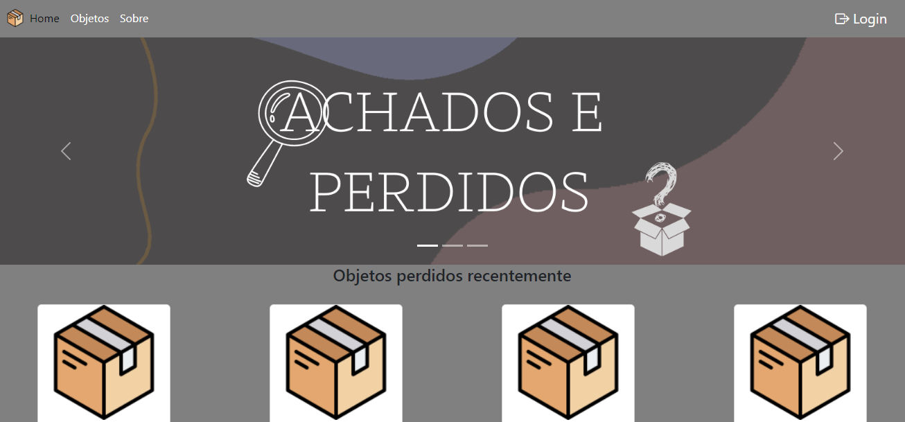

# Achados e Perdidos




> O Achados e Perdidos é um sistema web que possibilita o cadastro de objetos perdidos e os mostra em sua tela inicial, onde o possível dono pode reconhece-ló e tentar entrar em contanto com a pessoa que o encontrou.

## 💻 Pré-requisitos

Antes de começar, verifique se você atendeu aos seguintes requisitos:
* Você instalou a versão 7.4.29-0 / 8.0.18-0 / 8.1.5-0 do `Xampp`?

## 🚀 Instalando Achados e Perdidos

Para instalar o Achados e Perdidos, siga esta etapa:

Linux e Windows:
```
Instalar o Xampp de acordo com o indicado no site.
```

## ☕ Usando SGRU

Para usar Achados e Perdidos, siga esta etapa:

```
Inicie o Xampp juntamente com o Apache e MariaDB;
Acessa a aplicação pelo endereço localhost e porta configurada.
```
[⬆ Voltar ao topo](#achados-e-perdidos)<br>
